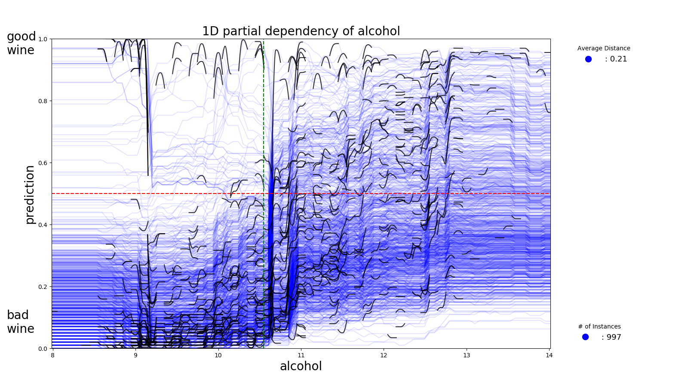
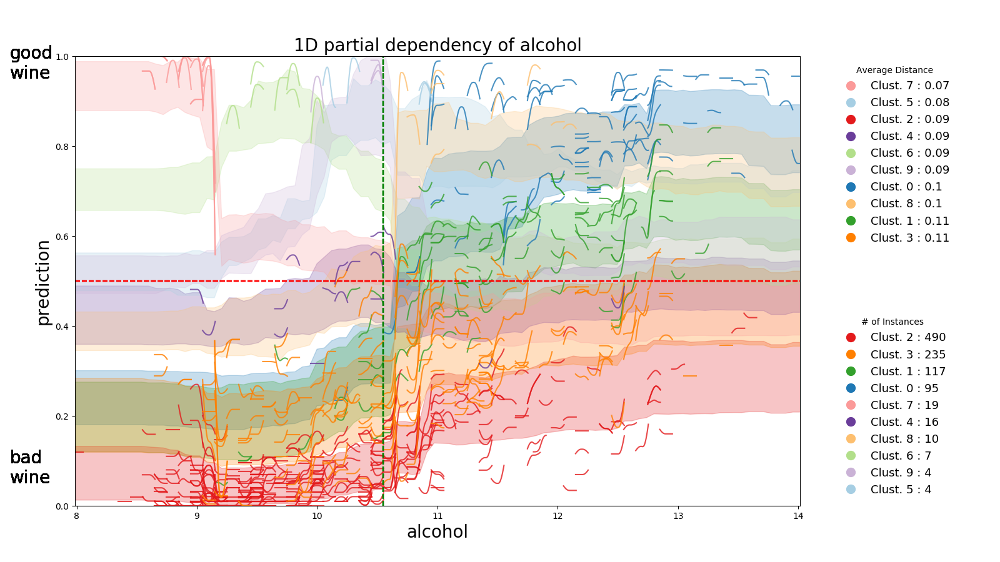
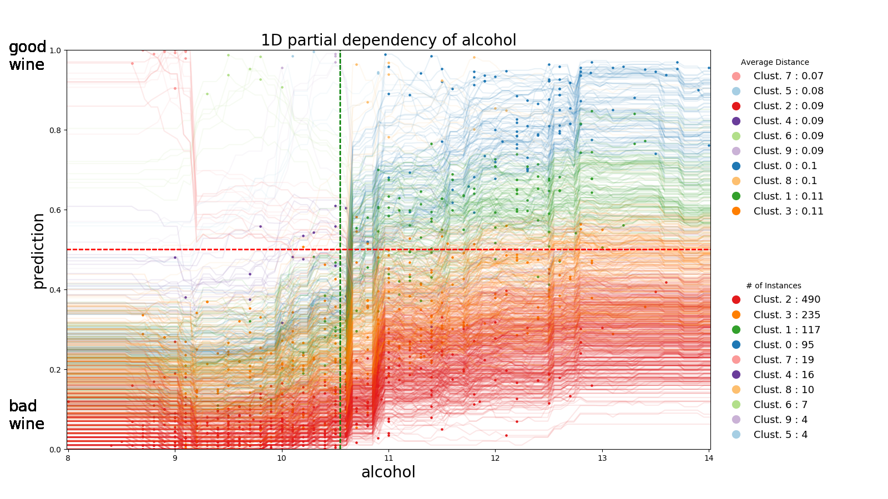
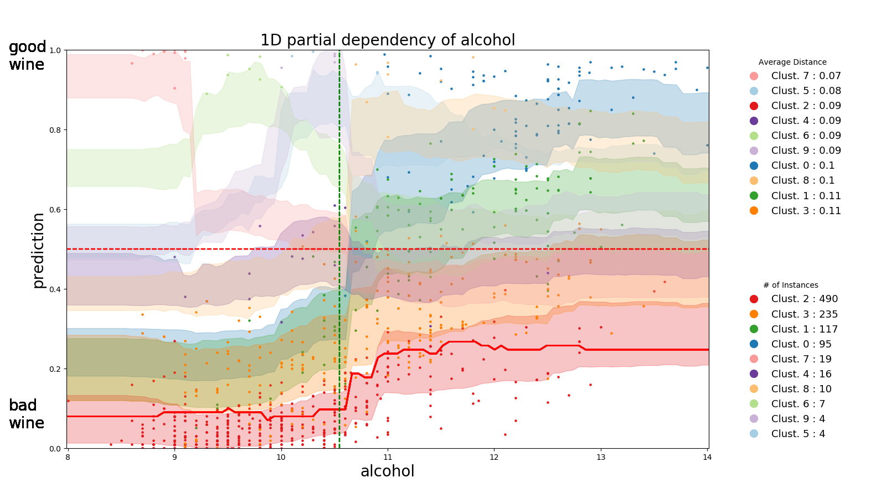
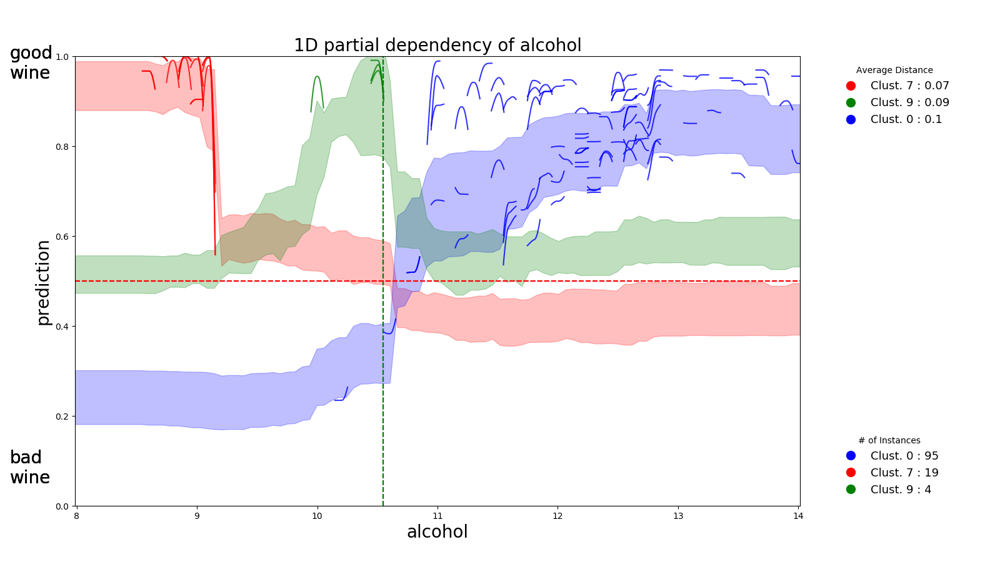
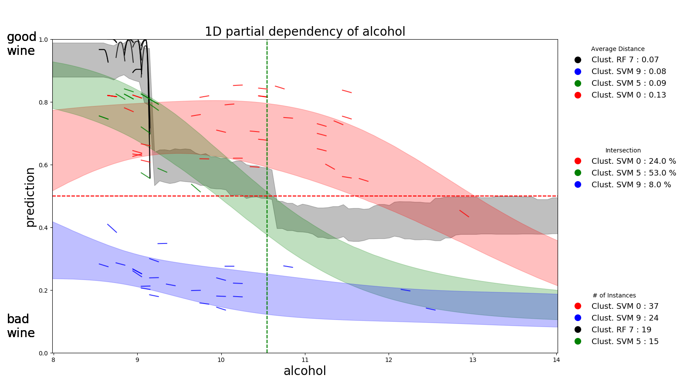

partial_dependence
==================

A library for plotting partial dependency patterns of machine learning classifiers.
Partial dependence measures the prediction change when changing one or more input features.
We will focus only on 1D partial dependency plots. 
For each instance in the data we can plot the prediction change as we change a single feature in a defined sample range.
Then we cluster similar plots, e.g., instances reacting similarly value changes, to reduce clutter.
The technique is a black box approach to recognize sets of instances where the model makes similar decisions.

You can install *partial_dependence* via

.. code:: bash

    pip install partial_dependence

and import it in python using:

.. code:: python

	import partial_dependence as pdp_plot

****************************************
Plotting clustering of partial dependence
****************************************

Following we will show the pipeline of functions works. Please refer to the inline documentation of the methods for full information.

You can also run the Jupyter notebook file to have a running example. 

Given the heavy visualizations, it is recommended to execute Jupyter with the following command:

.. code:: bash

	jupyter notebook --NotebookApp.iopub_data_rate_limit=10000000000

The visualization we are using as example are coming from a Random Forest Model trained on the `UCI Wine Quality Data Set <https://archive.ics.uci.edu/ml/datasets/wine+quality>`_ .
The prediction is towards the class "good wine".

Initialization
##############

Required arguments:
*******************

* ``df_test``: a ``pandas.DataFrame`` containing only the features 
  values for each instance in the test-set. 
* ``model``: trained classifier as an object with the following properties. 
  
  The object must have a method ``predict_proba(X)`` which takes a ``numpy.array`` of shape ``(n, num_feat)`` as input and returns a ``numpy.array`` of shape ``(n, len(class_array))``.

* ``class_array``: a list of strings with all the classes name in the same order 
  as the predictions returned by ``predict_proba(X)``.
* ``class_focus``: a string with the class name of the desired partial dependence.

Optional arguments:
*******************

* ``num_samples``: number of desired samples. Sampling a feature is done with:

  ``numpy.linspace(min_value,max_value,num_samples)``

  where the bounds are related to min and max value for that feature in the test-set. Default value is 100.
* ``scale``: scale parameter vector for normalization.
* ``shift``: shift parameter vector for normalization.

If you need to provide your data to the model in normalized form, 
you have to define scale and shift such that: 

``transformed_data = (original_data + shift)*scale``

where ``shift`` and ``scale`` are both ``numpy.array`` of shape ``(1,num_feat)``.

If the model uses directly the raw data in ``df_test`` without any transformation, 
do not insert any scale and shift parameters.

If our model does not use normalization, we can initialize the tool this way:

.. code:: python

	my_pdp_plot = pdp_plot.PartialDependence( my_df_test,
	                                          my_model,
	                                          my_labels_name,
	                                          my_labels_focus )

Creating the PdpCurves object
##############################

By choosing a feature and changing it in the sample range, for each row in the test-set we can create ``num_samples`` different versions of the original instance.

Then we are able to compute prediction values for each of the different vectors.

``pdp()`` initialize and returns a python object from the class ``PdpCurves`` containing such predictions values.

Required argument:
******************

* ``fix``: string with name of the chosen feature as reported in a column of ``df_test``.

.. code:: python

	curves = my_pdp_plot.pdp( chosen_feature )

Getting an overview of the partial dependence
#############################################

It is already possible to plot something with the function ``plot()``.

When ever you have a ``PdpCurves`` object available, you can plot something.
Here you can find a first example. The visualization is automatically saved in a png file in the same folder of the script.

.. code:: python

	my_pdp_plot.plot(curves,local_curves = True, plot_full_curves = True)

Clustering the partial dependence
#################################

To call ``compute_clusters()``, we define the integer number of desired clusters with the ``clust_number`` argument and we provide ``curves``.

The function returns a list of ``PdpCurves`` objects. Each element of the list is a different cluster.

.. code:: python

	curves_list = my_pdp_plot.compute_clusters( curves, chosen_cluster_number )

Plotting the clustering results
################################

Without customization, plotting the clustering is quite straightforward.

.. code:: python

	my_pdp_plot.plot( curves_list )

****************************************
Customization and extra functions
****************************************

Computing predictions in chunks
###############################

When using ``pdp()``, sometimes the amount of data to process is too large and it is necessary to divide it in chunks so that we don't run out of memory.
To do so, just set the optional argument ``batch_size`` to the desired integer number. ``batch_size`` cannot be lower than ``num_samples`` defined in the initialization. If ``batch_size`` is 0, then the computation of prediction will take place in a single chunk, which is much faster if you have enough memory.

.. code:: python

	curves = my_pdp_plot.pred_comp_all( the_matrix, batch_size = 1000 )

Clustering with DTW distance
############################

To cluster together the partial dependence plots, we measure the distance among each pair.
By default this distance is measured with RMSE.
Another option is `LB Keogh <http://www.cs.ucr.edu/~eamonn/LB_Keogh.htm>`_  distance, an approximation of Dynamic Time Warping (DTW) distance.
By setting the ``curves.r_param`` parameter of the formula to a value different from ``None``, you are able to compute the clustering with the LB Keogh.
The method ``get_optimal_keogh_radius()`` gives you a quick way to automatically compute an optimal value for ``curves.r_param``.
To set the distance back to RMSE just set ``curves.set_keogh_radius(None)`` before recomputing the clustering.

The first time you compute the clustering, a distance matrix is computed. 
Especially when using DTW distance, this might get time consuming.
After the first time you call ``compute_clusters()`` on the ``curves`` object, 
the distance matrix will be stored in memory and the computation will be then much faster.
Anyway if you change the radius with ``curves.set_keogh_radius()``, you will need to recompute again the distance matrix.

.. code:: python

	curves.set_keogh_radius( my_pdp_plot.get_optimal_keogh_radius() )
	keogh_curves_list = my_pdp_plot.compute_clusters( curves, chosen_cluster_number )

An example of the visualization customizations
##############################################

.. code:: python

	my_pdp_plot.plot( keogh_curves_list, local_curves = False, plot_full_curves = True )

Highlighting a custom vector
###########################

In case you want to highlight the partial dependence of a particular vector ``custom_vect``, this is how it works..

.. code:: python

	curves, custom_preds = my_pdp_plot.pdp( chosen_feature, chosen_row = custom_vect )

	my_pdp_plot.compute_clusters( curves, chosen_cluster_number )

	my_pdp_plot.plot( curves, local_curves = False,
	                   chosen_row_preds_to_plot = custom_preds )

Using your matplotlib figure
############################

If you really like to hand yourself matplotlib and be free to customize the visualization this is how it works:

.. code:: python

	curves_list = my_pdp_plot.compute_clusters(curves,ch_clust_number)

	cluster_7 = curves_list[7]
	cluster_0 = curves_list[0]
	cluster_9 = curves_list[9]

	fig, ax = plt.subplots(figsize=(16, 9), dpi=100)

	my_pdp_plot.plot(cluster_7,
	                   color_plot="red", 
	                   plot_object=ax)

	my_pdp_plot.plot(cluster_0,
	                   color_plot="blue", 
	                   plot_object=ax)

	my_pdp_plot.plot(cluster_9,
	                   color_plot="green", 
	                   plot_object=ax)

	plt.show()
	plt.close("all")

Comparing different models
##########################

There might be scenarios in which you want to compare clusters from different models.
For example let's compare the Random Forest model we had so far with a Support Vector Machine model.
A possible approach could be to check which clusters of the SVM model share the same instances with a selected cluster of the RF model.

.. code:: python

	curves_list_RF = my_pdp_plot_RF.compute_clusters(curves_RF, 10)
	curves_list_SVM = my_pdp_plot_SVM.compute_clusters(curves_SVM, 10)

	cluster_7_RF = curves_list_RF[7]
	set_RF = set(cluster_7_RF[1].get_ixs())

	for cluster_SVM in curves_list_SVM:
	    set_SVM = set(cluster_SVM[1].get_ixs())
	    intrs_size = len(set_RF.intersection(set_SVM))
	    
	    if intrs_size!=0:
	        clusters_SVM_related.append(cluster_SVM)

	fig, ax = plt.subplots(figsize=(16, 9), dpi=100)

	wine_pdp_plot_RF.plot(cluster_7_RF,
	                      color_plot="black", 
	                      plot_object=ax)

	color_legend = ["r","g","b"]

	wine_pdp_plot_SVM.plot(clusters_SVM_related,
	                       color_plot=color_legend,
	                       plot_object=ax)
	plt.show()
	plt.close("all")

The entire code to get also the legend updated with proper labels is present in the Jupyter notebook.

