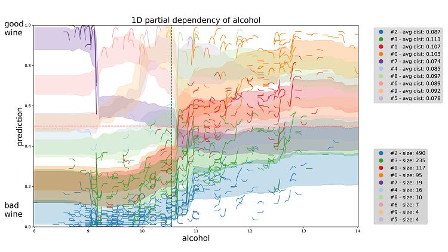
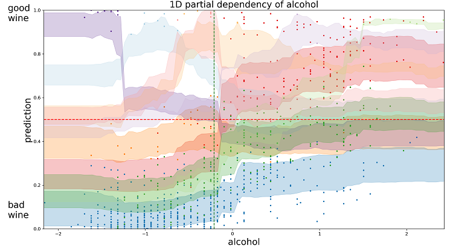
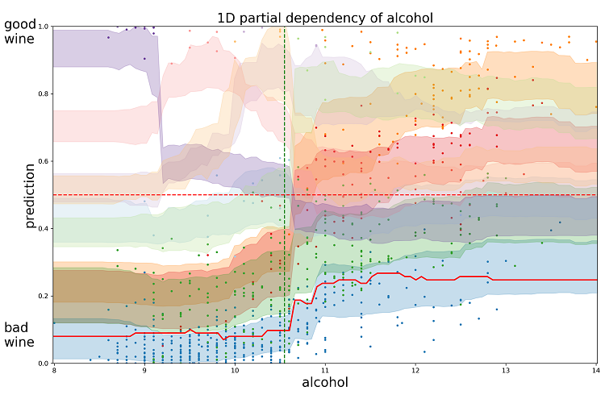

partial_dependence
==================

A library for plotting partial dependency patterns of machine learning classifiers.
Partial dependence measures the prediction change when changing one or more input features.
We will focus only on 1D partial dependency plots. 
For each instance in the data we can plot the prediction change as we change a single feature in a defined sample range.
Then we cluster similar plots, e.g., instances reacting similarly value changes, to reduce clutter.
The technique is a black box approach to recognize sets of instances where the model makes similar decisions.

You can install *partial_dependence* via

.. code:: bash

    pip install partial_dependence

and import it in python using:

.. code:: python

	import partial_dependence as pdp_plot

****************************************
Plotting clustering of partial dependence
****************************************

Following we will show the pipeline of functions works. Please refer to the inline documentation of the methods for full information.

You can also run the Jupyter notebook file to have a running example.

Initialization
##############

Required arguments:
*******************

* ``df_test``: a ``pandas.DataFrame`` containing only the features 
  values for each instance in the test-set. 
* ``model``: trained classifier as an object with the following properties. 
  
  The object must have a method ``predict_proba(X)`` which takes a ``numpy.array`` of shape ``(n, num_feat)`` as input and returns a ``numpy.array`` of shape ``(n, len(class_array))``.

* ``class_array``: a list of strings with all the classes name in the same order 
  as the predictions returned by ``predict_proba(X)``.
* ``class_focus``: a string with the class name of the desired partial dependence.

Optional arguments:
*******************

* ``num_samples``: number of desired samples. Sampling a feature is done with:

  ``numpy.linspace(min_value,max_value,num_samples)``

  where the bounds are related to min and max value for that feature in the test-set.
* ``scale``: scale parameter vector for normalization.
* ``shift``: shift parameter vector for normalization.

If you need to provide your data to the model in normalized form, 
you have to define scale and shift such that: 

``transformed_data = (original_data + shift)*scale``

where ``shift`` and ``scale`` are both ``numpy.array`` of shape ``(1,num_feat)``.

If the model uses directly the raw data in ``df_test`` without any transformation, 
do not insert any scale and shift parameters. 

.. code:: python

	my_pdp_plot = pdp_plot.PartialDependence( my_df_test,
	                                          my_model,
	                                          my_labels_name,
	                                          my_labels_focus,
	                                          my_number_of_samples,
	                                          my_scale,
	                                          my_shift )

Creating the matrix of instances vectors
########################################

By choosing a feature and changing it in sample range, for each row in the test-set we can create ``num_samples`` different versions of the original instance.

``pdp()`` returns a 3D matrix ``numpy.array`` of shape ``(num_rows,num_samples,num_feat)`` storing all those different versions.

Required argument:
******************

* ``fix``: string with name of the chosen feature as reported in a column of ``df_test``.

.. code:: python

	the_matrix = my_pdp_plot.pdp( chosen_feature )

Computing prediction changes
############################

By feeding ``the_matrix`` to ``pred_comp_all()`` we are able to compute prediction values for each of the different vectors.

.. code:: python

	preds = my_pdp_plot.pred_comp_all( the_matrix )

In ``preds``, a ``numpy.array`` of shape ``(num_rows,num_samples)``, we have for each element a prediction linked to an original instance of the test-set and a precise sample of the ``chosen_feature``.

Clustering the partial dependence
#################################

To call ``compute_clusters()``, we define the integer number of desired clusters with the ``clust_number`` argument and we provide the computed predictions series ``preds``.

The function will return a ``numpy.array`` with size equal to the size of the test-set. Each element reports an integer cluster label relative to the instance with same index in the test-set. 

.. code:: python

	labels_clusters = my_pdp_plot.compute_clusters( preds, chosen_cluster_number )

Plotting the results
####################

Without customization, plotting is quite straightforward.
The visualization is automatically saved in a png file in the same folder of the script.

.. code:: python

	my_pdp_plot.plot( preds, labels_clusters )

****************************************
Customization and extra functions
****************************************

Computing predictions in chunks
###############################

When using ``pred_comp_all()``, sometimes the amount of data to process is too large and it is necessary to divide it in chunks so that we don't run out of memory.
To do so, just set the optional argument ``batch_size`` to the desired integer number. ``batch_size`` cannot be lower than ``num_samples`` defined in the initialization.

.. code:: python

	preds = my_pdp_plot.pred_comp_all( the_matrix, batch_size = 1000 )

Clustering with DTW distance
############################

To cluster together the partial dependence plots, we measure the distance among each pair.
By default this distance is measured with RMSE.
By using the optional argument ``lb_keogh_bool``, you can use `LB Keogh <http://www.cs.ucr.edu/~eamonn/LB_Keogh.htm>`_ distance, an approximation of Dynamic Time Warping (DTW) distance.

.. code:: python

	labels_clusters = my_pdp_plot.compute_clusters( preds, chosen_cluster_number, lb_keogh_bool = True )

Data points representations
###########################

.. code:: python

	my_pdp_plot.plot( preds, labels_clusters, local_curves = False )

Highlighting a Custom Vector
###########################

In case you want to highligh a particular vector partial dependence to compare with the clusters, this is how it works..

.. code:: python

	the_matrix, custom_vectors = my_pdp_plot.pdp( chosen_feature, chosen_row = custom_vect )

	preds,custom_preds = my_pdp_plot.pred_comp_all( the_matrix, chosen_row_alterations = custom_vectors )

	labels_clusters = my_pdp_plot.compute_clusters( preds, chosen_cluster_number )

	my_pdp_plot.plot( preds, labels_clusters, local_curves = False,
	                   chosen_row_preds_to_plot = custom_preds )

